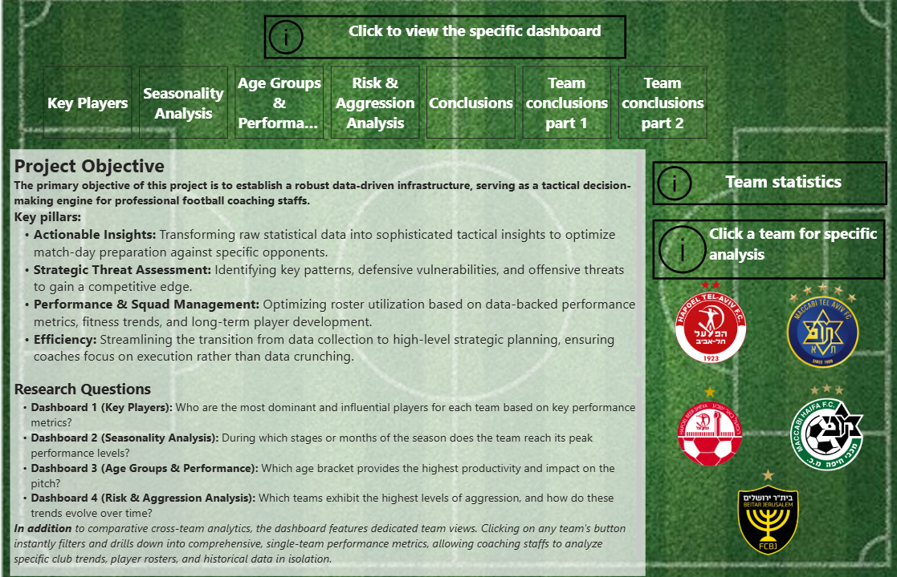

#  Football Analytics & ETL Pipeline

An end-to-end data project that automates the flow of football match data from storage to an interactive Power BI dashboard for tactical analysis.

---

##  About the Project
I built this project to serve as a practical decision-making tool for football coaching staffs. Instead of just crunching numbers, the goal was to turn raw statistics into clear tactical insights focusing on player performance, monthly trends, and match aggression.

##  Key Features & Views
* **Main Menu Hub:** Centralized navigation with dynamic filters and quick access to individual club stats (like Beitar Jerusalem, Hapoel Tel Aviv, and Maccabi Haifa).
* **Key Players:** Highlights top performers, match impact, and individual contributions to goals and assists.
* **Seasonality Analysis:** Tracks monthly performance spikes and trends across the season.
* **Risk & Aggression:** Evaluates tactical discipline and booking trends over time.

---

##  How the Pipeline Works 
1. **Extract:** Pulls raw match and player records from **MongoDB**.
2. **Transform:** Cleans, normalizes, and processes data using **Python & Pandas** inside an **Apache Airflow DAG**.
3. **Load:** Stores the structured data into a relational **PostgreSQL** database.
4. **Visualize:** Connects directly to **Power BI** for final reporting and exploration.
