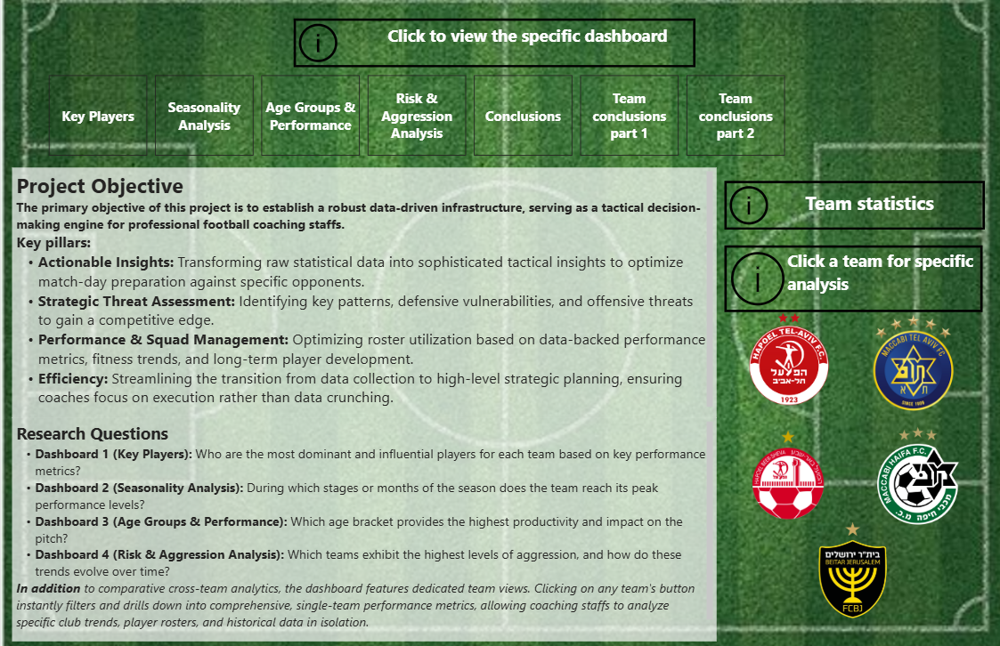

# Football Analytics & ETL Pipeline

An end-to-end data project that automates the flow of football match data from storage to an interactive Power BI dashboard for tactical analysis.

---

## About the Project
I built this project to serve as a practical decision-making tool for football coaching staffs. Instead of just crunching numbers, the goal was to turn raw statistics into clear tactical insights focusing on player performance, monthly trends, and match aggression.

## Key Features & Views
* **Main Menu Hub:** Centralized navigation with dynamic filters and quick access to individual club stats (like Beitar Jerusalem, Hapoel Tel Aviv, and Maccabi Haifa).
* **Key Players:** Highlights top performers, match impact, and individual contributions to goals and assists.
* **Seasonality Analysis:** Tracks monthly performance spikes and trends across the season.
* **Risk & Aggression:** Evaluates tactical discipline and booking trends over time.

---

## How the Pipeline Works 
1. **Extract:** Pulls raw match and player records from **MongoDB**.
2. **Transform:** Cleans, normalizes, and processes data using **Python & Pandas** inside an **Apache Airflow DAG**.
3. **Load:** Stores the structured data into a relational **PostgreSQL** database.
4. **Visualize:** Connects directly to **Power BI** for final reporting and exploration.

##  Dashboard Views & Analysis

### 1. Age Groups & Performance

*Analyzes player performance, running distance metrics, and efficiency distribution across various career age groups.*

### 2. Seasonality Analysis

*Examines monthly and quarterly trends, year filters, and performance behavioral patterns throughout the season.*

### 3. Team Performance Deep-Dive (Hapoel Tel Aviv)

.png)
*Detailed tactical and granular analysis of a specific club, showcasing key performance indicators and positional breakdowns.*

---

##  Key Insights & Conclusions

* **Player Age Impact:** Performance analysis reveals a high concentration of offensive contributions (Goals & Assists) within the *Prime Career* group, alongside significant physical workload volumes.
* **Seasonal Trends:** The data clearly highlights how metrics shift across specific months using interactive slicers, pointing to performance peaks and tactical adjustments over time.
* **Granular Team Focus:** Transitioning to individual club analysis (such as Hapoel Tel Aviv) enables the identification of micro-level strengths and weaknesses, including running distance efficiency and match outcomes.
